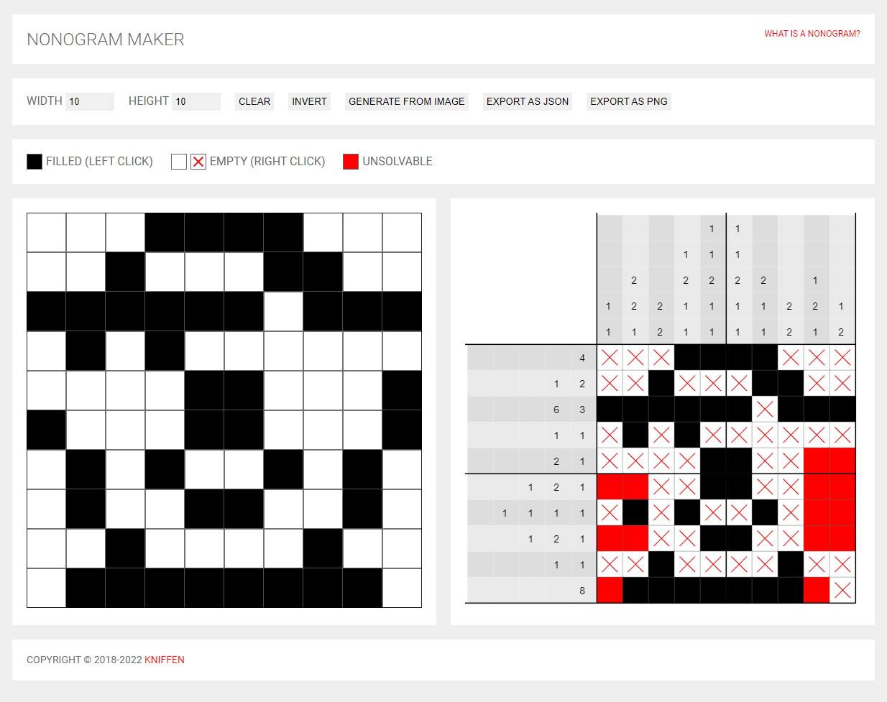

# Nonogram-Maker
A solvable [Nonogram](https://en.wikipedia.org/wiki/Nonogram) puzzle generator
 
Based on the Python [Nonogram Solver](https://github.com/mulka/nonogram-solver) by [@Mulka](https://github.com/mulka)

Try it at https://nonogram-maker.knifftech.org/

